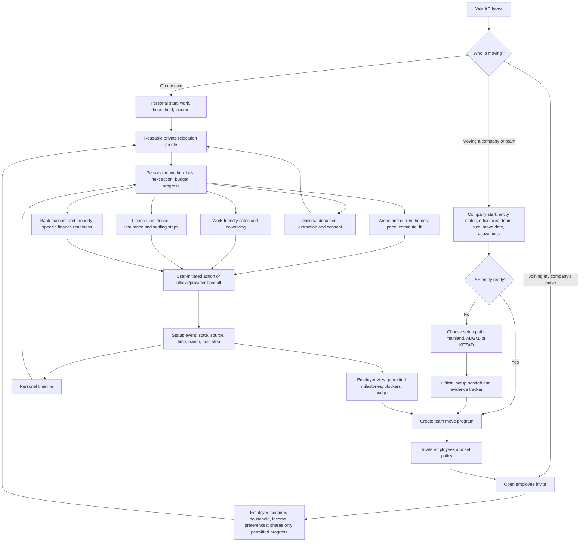

# Yala AD — app flow and build blueprint

## Product promise

Yala AD is an Abu Dhabi relocation action hub for freelancers, individuals, and companies moving teams. It turns a small amount of information into a personal move plan, relevant homes and places to work, setup and financial-readiness actions, and one honest timeline. It coordinates official and commercial handoffs; it does not pretend to issue licences, visas, bookings, or bank approvals itself.

## Whole-app flow

The company and individual routes share the same personal hub, recommendation engine, and status ledger. A company adds a move program, policy, employee invites, and an employer view; it does not duplicate the employee app.

## Connected page flow

The landing page at `/` introduces the three journeys. `/start` chooses one, `/move` creates or resumes a private plan, `/company` creates a team program, and `/join` accepts an invitation into the same private journey. A company opens its separate workspace at `/company/dashboard`.

Public `/areas` and `/setup` directories lead to focused detail pages with source links and a useful next action. The private move workspace combines areas, homes, workspaces, setup and finance in one page with in-place filters. Profile editing and the connected milestone timeline remain focused routes. Earlier category URLs lead into the matching workspace filter so saved links remain useful. Onboarding forms do not repeat on every dashboard page. Direct visits, back navigation and refresh preserve the relevant browser session and selected private profile.

A fresh browser has no demo records selected. A new company starts with no employees and can create its first invite link. A private plan with no affordable homes still offers work and official setup actions, explains the housing gap and lets the person edit the same profile. Empty timelines show a first action. The fictional five-employee demonstration is an explicit choice.

## Screens to build

| Screen | Minimum input or content | Main action |
| --- | --- | --- |
| 1. Welcome | Choose **My move**, **Join my company's move**, or **Move my team** | Start the right route |
| 2. Personal start | Work type, household, income or income range; optional invite pre-fills company policy | Create private profile |
| 3. Move hub | One priority action, realistic move budget, 3 area/home matches, nearby work options, setup and money cards | Open a useful next action |
| 4. Home detail | Source and fetch date, asking rent, estimated initial cash, commute, affordability, finance factors | Open original listing or agent contact |
| 5. My journey | Housing, work, setup, insurance, and money milestones with provenance | Continue, confirm manually, or resolve blocker |
| 6. Company start | Existing-entity answer, intended office area, team size, target date, allowances; ask jurisdiction only when setup is needed | Create move program |
| 7. Team command center | Employee invites, milestone counts, policy-fit housing, move budget, and blockers; no private banking data | Invite, assign, or follow up |
| 8. Company setup path | Mainland / ADGM / KEZAD route, required evidence, official links, clear handoff status | Open official service or record reference |

Keep progressive disclosure: ask a question only when it changes a recommendation or the next official step. Document upload remains optional inside **Evidence**, not the entry screen.

## Shared rules and boundaries

- **Recommendations:** deterministically filter by housing allowance/income, known fees, and hard constraints first. Rank the remaining area/home/workspace options by household needs, office commute, and preferences. Jev can rerank that shortlist; it must not override hard affordability rules.
- **Company privacy:** an employer can see an employee's invite acceptance, task state, dates, assigned actions, and housing-policy fit only if shared for the move. Personal income evidence, identity documents, bank eligibility, and lender results stay private unless the employee gives recipient-specific consent.
- **Status:** every milestone carries `state`, `source`, `updatedAt`, `owner`, and `nextAction`. Opening WhatsApp or an external portal means **opened**, not **sent** or **submitted**. Submission can be employee/HR-reported with a reference. **Confirmed** requires a provider event or suitable evidence; the UI must say which.
- **Finance:** display readiness factors, not an invented approval probability. Only a lender can approve or pre-approve a product.
- **Data:** live property records retain original listing links, asking rents, source, and fetch time. Synthetic examples are clearly labelled and never used for real agent contact. The temporary property extraction is not a production-cleared integration; see [property-data.md](property-data.md).

## Company integration map

| Workstream | Yala AD owns | External authority or provider owns | First build |
| --- | --- | --- | --- |
| Company establishment | Route selection, task list, evidence, handoff and reference tracking | [ADDED mainland setup](https://www.added.gov.ae/en/set-up/establish-your-business), [ADGM registration](https://www.adgm.com/registration-authority/registration-and-incorporation), or [KEZAD setup](https://www.kezadgroup.com/business-facilities/free-zone-business-setup-solutions/) | Official deep links; no claimed automatic filing |
| Employee work/residence | Per-person checklist, owner, due date, reference, status provenance | [Work Bundle and ICP services](https://icp.gov.ae/en/services/shared-services/) | Human-confirmed status; provider sync only if access is granted |
| Housing | Company policy and commute filter applied to each person's shortlist | Listing portal and agent | Source-linked listing/contact handoff |
| Insurance | Employer task and enrollment evidence | Insurer/broker; Abu Dhabi [health-insurance rules](https://www.doh.gov.ae/-/media/09AEC8C5B6D34AA88DE110F63641B863.ashx) | Task and link, not an issued policy |
| Workplaces and finance | Nearby options and readiness explanation | Venue and lender | Contact/booking/application handoff with honest state |

No public, generally available government status API is verified for this project. A true live status badge requires an approved integration or provider event; otherwise label the update as user- or employer-reported.

## Minimal data model

`PersonProfile` belongs to the person. `Organization` owns one or more `MoveProgram`s. A program defines office area, dates, housing policy, and invited `RelocationCase`s. Each case has `Task`s, `Recommendation`s, and append-only `StatusEvent`s. `ConsentGrant` controls any personal facts exposed to an organization or provider. Every external market fact is a `SourceRecord` with URL and checked time.

## Build order and demo slice

1. Replace the upload-first homepage with route choice and the three-answer personal start. Reuse `/api/analyze` as optional evidence intake.
2. Show a personal move hub backed by the existing `/api/properties` feed, dated source labels, a basic area/commute explanation, and deterministic affordability.
3. Add one real property contact handoff and one workspace contact/booking handoff; record **opened** events in the timeline.
4. Add a company program for an **already-established employer moving five employees**: policy, invites, employee cases, and an aggregate command center. This is the first complete B2B demo.
5. Add the jurisdiction-specific establishment route as a tracked official handoff, then seek approved provider integrations for actual status sync.

The demo succeeds when a company can create a five-person move, each invited employee can get a useful private housing-and-setup plan, and the employer can see genuine progress and blockers without seeing personal financial documents. An external link opening must never be shown as a confirmed outcome.
